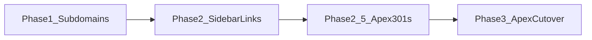

# Kahana Domain Consolidation — project charter

> **Purpose:** Source of truth for moving Kahana onto a clean host map: corporate content on dedicated subdomains, product app on the apex (`kahana.io`), and safe redirects from the legacy app host (`app.kahana.io`) — without breaking marketing, auth, or hub SEO.  
> **Audience:** Product, growth, engineering, ops.  
> **Last updated:** 2026-07-14  
> **Status:** Planning ✅ · Phase 1 (subdomains) ✅ · Phase 2 (sidebar) ✅ · Phase 2.5 (apex 301s) ✅ (confirm prod curl) · Phase 3 (apex cutover) ⬜  
> **Related:** [`HUB_SEO_CHARTER.md`](HUB_SEO_CHARTER.md), [`KAHANA_PLATFORM.md`](KAHANA_PLATFORM.md), marketing site [`kahana-homepage-public`](https://github.com/Kahana-LLC/kahana-homepage-public), Phase 1 runbook [`docs/PHASE1_CORPORATE_SUBDOMAINS.md`](docs/PHASE1_CORPORATE_SUBDOMAINS.md), Phase 2.5 map [`docs/PHASE2_5_APEX_REDIRECT_MAP.md`](docs/PHASE2_5_APEX_REDIRECT_MAP.md)

---

## 1. Goal

Establish a durable, brand-correct URL architecture:

| Host | Role (end state) |
|------|------------------|
| **`https://kahana.io`** | **Product app** (today’s `app.kahana.io` CRA) |
| **`https://about.kahana.io`** | **Company / marketing home** (what apex marketing is today) |
| **`https://newsroom.kahana.io`** | News / press |
| **`https://careers.kahana.io`** | Careers |
| **`https://help.kahana.io`** | Help / support docs |
| **`https://app.kahana.io`** | **Legacy** — permanent 301 → `kahana.io` (incl. `/hub/...`) |

**Out of scope:** `developers.kahana.io` (and any developer portal) for this project.

Hub discoverability (Google + AI) continues under [`HUB_SEO_CHARTER.md`](HUB_SEO_CHARTER.md); canonical host flips **only in Phase 3**.

---

## 2. Success criteria

| # | Done when |
|---|-----------|
| 1 | This charter is the team reference for domain work; linked from platform docs |
| 2 | `about`, `newsroom`, `careers`, `help` each resolve over HTTPS with correct content |
| 3 | Product sidebar (and other in-app company links) point at those subdomain URLs — not dead `kahana.io` paths that will later become the app |
| 4 | Apex `kahana.io` serves the product app; marketing home lives at `about.kahana.io` |
| 5 | `app.kahana.io` (and `app.kahana.io/hub/:id`, etc.) **301** to the matching `kahana.io` path |
| 6 | Auth / CORS / Firebase authorized domains / Stripe return URLs updated for the new hosts |
| 7 | Hub SEO canonicals, sitemap, `robots.txt`, Search Console updated to `kahana.io` after cutover |

**Not required for this project:** Developer portal, full marketing CMS redesign, EU consent gate.

---

## 3. Current state (baseline)

| Host | Today |
|------|--------|
| `kahana.io` | Marketing / brand site (Next — `kahana-homepage-public`) |
| `app.kahana.io` | Product CRA (`kahana-web` on Heroku `kahana-alpha`) |
| `curio.store` | Legacy alias — treat as non-canonical |
| Subdomains above | Not yet the durable company surfaces |

Hub SEO (sprint): bot HTML + sitemap still **canonical to `app.kahana.io` until Phase 3**.

---

## 4. Phased plan (locked order)

Do **not** move the product to the apex before subdomains and in-app links are ready. That avoids dual canonicals and broken marketing URLs.



### Phase 1 — Corporate subdomains live (apex unchanged)

**Intent:** Peel company content off the future product host while `kahana.io` and `app.kahana.io` keep today’s roles.

| Subdomain | Content source (target) | Notes |
|-----------|-------------------------|--------|
| `about.kahana.io` | Marketing home (`/` homepage) | Becomes the long-term “marketing homepage destination” |
| `newsroom.kahana.io` | `/` → `/blog`; press + events paths | Routed on this Next app (`config/corporateHosts.js`) |
| `careers.kahana.io` | `/` → `/careers` | Same |
| `help.kahana.io` | `/` → `/docs`; support + community paths | Same |

**Implementation (this repo):** host-aware middleware + [`docs/PHASE1_CORPORATE_SUBDOMAINS.md`](docs/PHASE1_CORPORATE_SUBDOMAINS.md). Canonicals remain on `kahana.io` in Phase 1.

**Exit criteria:**

- [x] Middleware + host config shipped to marketing Heroku app (`kahana-public` v435 / `512bede`)
- [x] DNS + TLS for each subdomain (`about` / `newsroom` / `careers` / `help.kahana.io`)
- [x] HTTPS content loads on each host
- [x] Staging/preview hosts if needed (`*-beta.kahana.io` on `kahana-public-beta`)
- [x] `developers.*` explicitly deferred

`kahana.io` marketing **stays as-is** in this phase.

### Phase 2 — Product app points at subdomains

**Intent:** Soften the cutover. Users already leave the app via correct URLs before apex swap.

In `kahana-web` (and mobile/web footers if applicable):

- Sidebar / nav / legal / marketing CTAs → `about`, `newsroom`, `careers`, `help` absolute HTTPS URLs
- Remove or avoid deep links into `kahana.io` paths that will become product routes after Phase 3

**Exit criteria:**

- [x] Staging (`kahana-beta`) QA of sidebar destinations
- [x] Prod ship on `app.kahana.io`
- [x] No reliance on apex marketing paths for those four areas

### Phase 2.5 — Marketing off apex (hard 301s)

**Intent:** Clear `kahana.io` of marketing 200s so Phase 3 can bind apex to the product CRA.

- Map in [`docs/PHASE2_5_APEX_REDIRECT_MAP.md`](docs/PHASE2_5_APEX_REDIRECT_MAP.md) + [`config/apexRedirects.js`](config/apexRedirects.js)
- Middleware 301 when `Host` is `kahana.io` only; company subdomains still 200
- `/` → `https://about.kahana.io/`; Oasis leftovers → about home
- Sitemap / robots prefer subdomain locs

**Exit criteria:**

- [x] Redirect inventory locked
- [x] Hard 301s on apex marketing paths
- [x] Marketing home decision: `about.kahana.io`
- [x] Sitemap / robots prefer subdomains
- [x] Curl gate: `/` and core clusters → 301 to company hosts

### Phase 3 — Apex = product; redirects; marketing → about

**Intent:** `kahana.io` becomes the main product domain.

1. **Move / point product** Heroku (or edge) so **`kahana.io` serves the CRA app**.
2. Apex marketing paths already 301 to company hosts (Phase 2.5); confirm about still serves home.
3. **301 forever:**
   - `https://app.kahana.io/` → `https://kahana.io/`
   - `https://app.kahana.io/hub/:id` → `https://kahana.io/hub/:id`
   - Same for `/explore`, `/profile/...`, etc. (path-preserving)
4. **Config cutover checklist** (non-exhaustive):
   - Firebase Auth authorized domains + OAuth redirect URIs
   - Cloud Functions CORS / `verifiedOrigin` allowlists
   - `APP_BASE_URL` / `REACT_APP_*` / password-reset continue URLs
   - Stripe Connect / Checkout return and webhook-related URLs if host-bound
   - Mixpanel / analytics production host assumptions
5. **Hub SEO cutover** (see §6):
   - Canonical + sitemap + `llms.txt` + `robots.txt` Sitemap → `https://kahana.io`
   - Search Console: property for `kahana.io`, submit sitemap; keep monitoring `app.kahana.io` redirects
   - Update [`HUB_SEO_CHARTER.md`](HUB_SEO_CHARTER.md) status line

**Exit criteria:**

- [ ] Product usable only via `kahana.io` (cookies, login, hubs, Explore, paywall)
- [ ] `curl -I https://app.kahana.io/hub/<id>` → **301** → `kahana.io/hub/<id>`
- [ ] About content reachable on `about.kahana.io`; critical marketing URLs redirected
- [ ] Hub bot HTML / sitemap list `kahana.io` locs only
- [ ] `curio.store` either 301s into the new map or stays explicitly legacy/non-indexed

---

## 5. Host decision rules

| Situation | Rule |
|-----------|------|
| Indexed product URLs | **One** canonical host — after Phase 3, always `kahana.io` |
| Dual live product hosts | Forbidden without 301; never ship hubs on both hosts as 200 |
| Company content | Prefer durable subdomains; do not put About/Careers/Newsroom/Help under the product SPA long-term |
| Legacy `app.kahana.io` | Redirect layer only after Phase 3; no new features hardcoded to it |
| Marketing apex during Phases 1–2 | Keep serving; plan 301 map → `about.kahana.io` before Phase 3 flip |

---

## 6. Hub SEO intersection

| Phase | Canonical product host for hubs |
|-------|----------------------------------|
| 1–2 | **`https://app.kahana.io`** (current SEO sprint) |
| 3+ | **`https://kahana.io`** |

Until Phase 3 ships: do **not** advertise hubs as `kahana.io/hub/...` in sitemap/`llms.txt` if that host is still marketing-only.

Implementation touchpoints at Phase 3: Helmet `APP_CANONICAL_ORIGIN`, Functions `getSeoCanonicalBaseUrl()` / prod default, nginx `SEO_API_BASE_URL`, `public/robots.txt`, Search Console.

---

## 7. Risks & mitigations

| ID | Risk | Mitigation |
|----|------|------------|
| R1 | Apex swap breaks Google OAuth / magic links | Pre-add `kahana.io` to Firebase authorized domains; test login on staging custom domain first |
| R2 | Duplicate hosting (`app` + apex both 200) | Cut DNS/Heroku + 301 in one window; verify with curl |
| R3 | Marketing SEO loss on apex | Inventory key `kahana.io` URLs; 301 map → `about.kahana.io` |
| R4 | Hardcoded `app.kahana.io` in emails/CTAs | Grep + Mixpanel/UTM templates + email templates before flip |
| R5 | CORS / `Unverified` API after cutover | Update `corsConfig` / `verification.ts`; redeploy Functions before DNS TTL fades |
| R6 | Hub SEO still points at `app` after cutover | Checklist in §4 Phase 3 + SEO charter update |

---

## 8. Workstreams / ownership (fill as assigned)

| Workstream | Typical owner | Artifacts |
|------------|---------------|-----------|
| DNS + TLS + Heroku domains | Ops / eng | Domain list, cert status |
| Subdomain apps / content | Marketing + eng | about / newsroom / careers / help |
| Product sidebar + link audit | Product eng (`kahana-web`) | Nav constants, tests |
| Auth / CORS / payments config | Backend eng | Firebase, Functions, Stripe |
| Apex cutover + redirects | Ops + eng | nginx / Heroku / CDN 301s |
| Hub SEO host flip | Eng | `HUB_SEO_CHARTER`, Search Console |

---

## 9. QA cheat sheet

```bash
# Phase 1
curl -sSI https://about.kahana.io/ | head
curl -sSI https://newsroom.kahana.io/ | head
curl -sSI https://careers.kahana.io/ | head
curl -sSI https://help.kahana.io/ | head

# Phase 2.5 (expect 301 → company subdomain)
curl -sSI https://kahana.io/ | head -15
curl -sSI https://kahana.io/about | head -15
curl -sSI https://kahana.io/blog | head -15
curl -sSI https://kahana.io/docs | head -15
curl -sSI https://kahana.io/careers | head -15

# Phase 3 redirects
curl -sSI https://app.kahana.io/hub/$HUB_ID | head
# Expect: HTTP/2 301  Location: https://kahana.io/hub/$HUB_ID

# Product on apex
curl -sS -A "Googlebot" "https://kahana.io/hub/$HUB_ID" | head
curl -sS "https://kahana.io/sitemap.xml" | head
curl -sS "https://kahana.io/robots.txt"
```

---

## 10. Open questions (non-blocking for Phase 1)

| # | Question | Default if undecided |
|---|----------|----------------------|
| 1 | Single repo vs separate deploys per subdomain? | Separate or monorepo OK; each host must be independently shippable |
| 2 | Staging subdomain pattern? | e.g. `about.beta…` or Heroku apps + temporary DNS |
| 3 | Keep `www.kahana.io`? | 301 `www` → apex product after Phase 3 (or → about if www was marketing-only) |
| 4 | `curio.store` timeline? | 301 into `kahana.io` map when apex cutover is stable |

---

## 11. Changelog

| Date | Note |
|------|------|
| 2026-07-14 | Charter created: Phase 1 subdomains → Phase 2 sidebar → Phase 3 apex product + `app` 301s; marketing home → `about.kahana.io`; developers OOS; SEO host flip deferred to Phase 3 |
| 2026-07-14 | Phase 1 started in `kahana-homepage-public`: `config/corporateHosts.js` + middleware rewrites; runbook `docs/PHASE1_CORPORATE_SUBDOMAINS.md` |
| 2026-07-14 | Phase 2 ✅ (product sidebar). Phase 2.5 ✅: apex marketing 301s + subdomain sitemap locs (`docs/PHASE2_5_APEX_REDIRECT_MAP.md`) |
