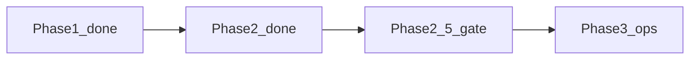

# Domain cutover readiness — `app.kahana.io` → `kahana.io`

> **Purpose:** Ops checklist living in the **marketing** repo for Phase 2.5 / pre–Phase 3 gates. Product cutover steps (§7) still execute in **`kahana-web`** + Heroku/Firebase.  
> **Audience:** Product, engineering, ops.  
> **Verified:** 2026-07-14 (prod curl after `kahana-public` v436)  
> **Verdict:** **Phase 2.5 live on prod.** Phase 3 remains ops + `kahana-web` cutover.  
> **Charters:** [`DOMAIN_ARCHITECTURE_PROJECT_CHARTER.md`](docs/DOMAIN_ARCHITECTURE_PROJECT_CHARTER.md) (pointer), [`DOMAIN_CONSOLIDATION_CHARTER.md`](DOMAIN_CONSOLIDATION_CHARTER.md), redirect map [`docs/PHASE2_5_APEX_REDIRECT_MAP.md`](docs/PHASE2_5_APEX_REDIRECT_MAP.md), product handoff [`docs/PHASE3_KAHANA_WEB_HANDOFF.md`](docs/PHASE3_KAHANA_WEB_HANDOFF.md)

---

## 1. Verdict (plain language)

| Ready? | Why |
|--------|-----|
| **Phase 2.5 (prod)** | Apex Host=`kahana.io` hard-301s marketing paths via [`middleware.js`](middleware.js) + [`config/apexRedirects.js`](config/apexRedirects.js). `/` → `about.kahana.io/`. Confirmed on `kahana-public` v436. |
| **Phase 3** | Still **ops + product**: rebind `kahana.io` → `kahana-alpha`, `app.` 301s, Firebase/CORS/hub SEO. Marketing apex gate is green; cutover not started. |

**Discover** may keep linking `https://kahana.io` for post–Phase 3 product entry; until Phase 3 that URL 301s to **about.** — product explore remains **`app.kahana.io`**.

---

## 2. Target end state

```
kahana.io              → Product CRA (today’s app.kahana.io)
kahana.io/hub/…        → Product hubs
about.kahana.io        → Company / marketing home
newsroom.kahana.io     → News / press
careers.kahana.io      → Careers
help.kahana.io         → Docs / help
app.kahana.io          → 301 → kahana.io (path-preserving, incl. /hub)
```

---

## 3. Phase scorecard

| Phase | Intent | Status | Evidence |
|-------|--------|--------|----------|
| **1** Corporate subdomains | `about` / `newsroom` / `careers` / `help` live over TLS | **Done** | Each host returns **HTTP 200** on `kahana-public`. |
| **2** Product → subdomains | In-app Resources open subdomain URLs | **Done** | Product `COMPANY_RESOURCE_LINKS` on `kahana-alpha` / `app.kahana.io`. |
| **2.5** Marketing off apex | Apex marketing paths **301** to subdomains; home at `about.` | **Done on prod (v436)** | Map + middleware + subdomain sitemap locs. See §6. |
| **3** Apex = product | `kahana.io` → CRA; `app.` → apex 301; auth + hub SEO flip | **Blocked until ops cutover** | Heroku still: **`kahana.io` → `kahana-public`**; **`app.kahana.io` → `kahana-alpha`**. |



---

## 4. Live inventory

### Hosting

| Host | Serves today | Heroku app |
|------|----------------|------------|
| `kahana.io`, `www.kahana.io` | Marketing Next (after 2.5: apex 301s off) | `kahana-public` |
| `about` / `newsroom` / `careers` / `help.kahana.io` | Company sections (host-aware) | `kahana-public` |
| `app.kahana.io` | Product CRA | `kahana-alpha` |

### Curl matrix (Phase 2.5 gate)

| URL | Expect after deploy | Location host |
|-----|---------------------|---------------|
| `https://kahana.io/` | **301** | `about.kahana.io` |
| `https://kahana.io/about` | **301** | `about.kahana.io` |
| `https://kahana.io/blog` | **301** | `newsroom.kahana.io` |
| `https://kahana.io/docs` | **301** | `help.kahana.io` |
| `https://kahana.io/careers` | **301** | `careers.kahana.io` |
| `https://about.kahana.io/` | **200** | — |
| `https://app.kahana.io/` | **200** | Product home |

---

## 5. Why Phase 2.5 was mandatory

If DNS for `kahana.io` pointed at `kahana-alpha` **before** apex marketing paths redirect:

1. Marketing homepage disappears (or fights the SPA for `/`).
2. Paths like `/about`, `/blog`, `/docs` 404 or wrong content inside the CRA.
3. Dual hosts and ranking risk until 301s settle.
4. Bookmarks to apex marketing break without a redirect table.

Order: **subdomains → product links → marketing off apex → then apex = product.**

---

## 6. Exit criteria for Phase 2.5 (this repo)

- [x] Locked URL inventory: [`docs/PHASE2_5_APEX_REDIRECT_MAP.md`](docs/PHASE2_5_APEX_REDIRECT_MAP.md) + [`config/apexRedirects.js`](config/apexRedirects.js)
- [x] **301** from apex paths → subdomain URLs (`middleware.js`, Host=`kahana.io` only; skip `/api`)
- [x] Marketing **home** at `about.kahana.io` (`/` → about)
- [x] Sitemap / robots prefer subdomain hosts
- [ ] Search Console: Domain property `kahana.io` verified + corporate/app sitemaps submitted — `docs/GOOGLE_ANALYTICS_AND_SEARCH_CONSOLE.md`
- [x] Deployed + QA on **kahana-public-beta** (v168): subdomain sitemap locs live; beta app still 200 for browsing
- [x] Local Host=`kahana.io` curl matrix → 301 (see §8)
- [x] Prod (`kahana-public`) deploy + curl gate — **v436 / `e144cb2`** (2026-07-14)

Prod curl gate is green. Phase 3 ops (§7) can proceed when ready; still do not rebind apex until §7 checklist is executed intentionally.

---

## 7. Phase 3 cutover checklist (product + ops — `kahana-web`)

Only after Phase 2.5 prod curl is green:

### DNS / Heroku

- [ ] Add `kahana.io` (and `www` policy) to **`kahana-alpha`**
- [ ] Remove / stop serving product-colliding apex routes on **`kahana-public`**
- [ ] Path-preserving **301** `app.kahana.io/*` → `kahana.io/*` (incl. `/hub/:id`)
- [ ] Decide `curio.store` / `www.kahana.io` (301 to apex product)

### App + API config

- [ ] Firebase Auth authorized domains + OAuth redirect URIs include `kahana.io`
- [ ] Functions CORS / verification allowlist includes `kahana.io`
- [ ] Env: `APP_BASE_URL` / `REACT_APP_*` / password-reset continue URLs
- [ ] Stripe return URLs if host-bound
- [ ] Mixpanel / email CTAs / marketing links no longer hardcode `app.kahana.io` as the only product URL

### Hub SEO (`kahana-web` + Functions)

- [ ] Flip `APP_CANONICAL_URL` / `APP_CANONICAL_ORIGIN` → `https://kahana.io`
- [ ] Prod Functions SEO sitemap / canonical / `llms.txt` → `kahana.io`
- [ ] `public/robots.txt` Sitemap line → `https://kahana.io/sitemap.xml`
- [ ] Search Console: Domain property already live; after cutover monitor `app.` → apex 301s — `docs/GOOGLE_ANALYTICS_AND_SEARCH_CONSOLE.md`

### Regression

- [ ] Login / signup / OAuth on apex
- [ ] Explore, hub open, checkout, billing
- [ ] `curl -sSI https://app.kahana.io/hub/$HUB_ID` → **301** → `https://kahana.io/hub/$HUB_ID`
- [ ] Googlebot HTML on `https://kahana.io/hub/$HUB_ID` still 200 with apex canonical

---

## 8. Re-verify commands

```bash
# Phase 1
for h in about newsroom careers help; do curl -sS -o /dev/null -w "$h %{http_code}\n" "https://$h.kahana.io/"; done

# Phase 2.5 gate (expect 301 + Location host = subdomain)
curl -sSI https://kahana.io/ | head -15
curl -sSI https://kahana.io/about | head -15
curl -sSI https://kahana.io/blog | head -15
curl -sSI https://kahana.io/docs | head -15
curl -sSI https://kahana.io/careers | head -15
curl -sS -o /dev/null -w "%{http_code}\n" https://about.kahana.io/

# Who owns apex today?
heroku domains -a kahana-public | head -20
heroku domains -a kahana-alpha | head -20

# Product still on app until Phase 3
curl -sS -o /dev/null -w 'app %{http_code}\n' https://app.kahana.io/explore
```

---

## 9. Document history

| Date | Note |
|------|------|
| 2026-07-14 | Created after prod ship of Phase 2 chrome + Hub SEO. **Verdict: Phase 3 blocked on Phase 2.5.** |
| 2026-07-14 | Phase 2.5 implemented in marketing (`apexRedirects` + middleware 301s + subdomain sitemap). Checklist lives here; product cutover §7 remains `kahana-web`. |
